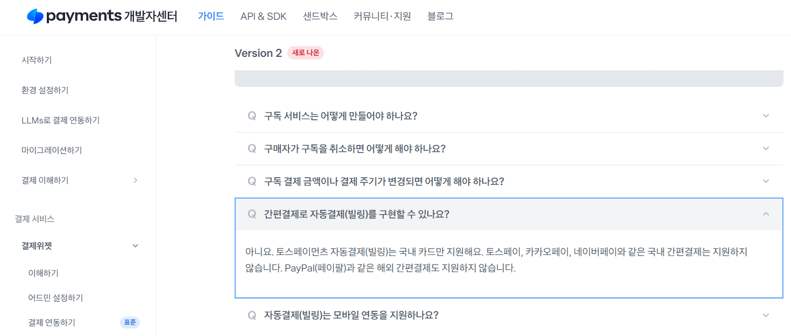

# [결제 시스템] 결제대행사 조사
## 조사 결과

[검색에 활용한 GPT 링크](https://chatgpt.com/share/685a52c1-d1a4-8004-ace3-2bcc2e408f3d)(대화하면서 추가 검색 및 조사 진행)

1. 적합한 결제 모델을 제공하는 대행사를 탐색
    
    I.   VISA, MASTER 카드 혹은 애플페이, 페이팔 같이 해외에서 통용될 수 있는 결제 방법 제공
    
    II.  위의 결제 수단을 통해 정기 결제(구독 혹은 자동 결제[빌링])가 가능해야 함
    
    III. 구독자 이외에도 임차인으로부터 월세, 공과금 등을 우리가 받고, 임대인에게 분배하는 구조
    
    문의 메일 혹은 상담을 통해 해외 정기 결제 및 마켓 플레이스 서비스 제공 여부 확인
    
    - [토스페이먼츠](https://docs.tosspayments.com/guides/v2/billing)(2위)
        
        
        
        국내 카드 이외에 자동결제 지원 X
        
        다만, 기본적으로 VISA 및 Master 카드 결제를 [신용·체크카드 탭에서 지원](https://docs.tosspayments.com/guides/v2/learn/foreign-payment?utm_source=chatgpt.com#%ED%95%B4%EC%99%B8-%EC%B9%B4%EB%93%9C-%EC%97%B0%EB%8F%99%ED%95%98%EA%B8%B0)하며 [샌드박스](https://developers.tosspayments.com/sandbox), [샘플 프로젝트](https://github.com/tosspayments/tosspayments-sample), [어드민 페이지](https://consumer.tosspayments.com/ex/payment-widget?menu=card-company-layout) 등 다방면으로 개발에 필요한 도구가 지원되어 생산성이 높음
        
        신용·체크카드 및 간편 결제, 브랜드페이(사설 간편 결제) 등 자동 결제가 국내 카드에 제한된다는 점만 제외하면 지원 기능 많음
        
        - 토스페이먼츠 해외결제 서비스 소개서
            
            [토스페이먼츠_해외결제소개.pdf](%ED%86%A0%EC%8A%A4%ED%8E%98%EC%9D%B4%EB%A8%BC%EC%B8%A0_%ED%95%B4%EC%99%B8%EA%B2%B0%EC%A0%9C%EC%86%8C%EA%B0%9C.pdf)
            
    - KG이니시스(3위)
        
        토스페이먼츠와 마찬가지로 빌링 결제의 경우 국내 발급된 카드만 연동되어 해외 발급 카드는 결제 진행이 어렵습니다. 
        또한, 실제 사이트에 호스팅(기존 PG사 제휴 사이트와 연동) 또는 독립몰(자체 개발) 구현 상황을 담당자가 확인한 이후에 정산 구조 가능 여부를 계약 담당자가 전해줄 수 있습니다.
        
    - KCP NHN(점유율 1위)
        
        메일 응답:
        
        죄송하게도 중개플랫폼은 당사 입점이 불가합니다.
        
        월세 등은 월세업자 개별계약, 개별 정산만 가능한 점 양해 부탁드립니다.
        
        ---
        
        즉, 부동산 중개업에 한해서는 마켓 플레이스 제공이 불가하다고 연락 받았습니다.
        
    - 나이스페이먼츠(4위)
        
        포스타트(스타트업 지원) 기준 VAT(10% 별도), 따로 구독 및 해외 결제에 대한 정보 X
        
        
        
        
        
    
    → 결론적으로 메이저한 1차 대행사 4곳은 해외 정기 결제가 불가하고, 부동산 중개업에 한정해
    
    (월세) 정산 기능에 대한 API 지원을 하지 않음(KCP NHN)