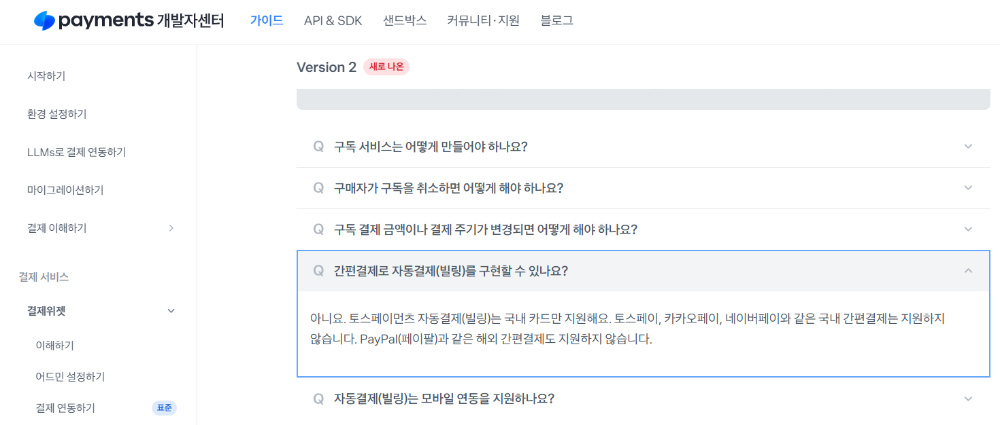

# 결제 대행사 조사
[검색에 활용한 GPT 링크](https://chatgpt.com/share/685a52c1-d1a4-8004-ace3-2bcc2e408f3d)(대화하면서 추가 검색 및 조사 진행)
    
1. 우리 서비스에 적합한 결제 모델을 제공하는 대행사를 탐색
    
    I.   VISA, MASTER 카드 혹은 애플페이, 페이팔 같이 해외에서 통용될 수 있는 결제 방법 제공
    
    II.  위의 결제 수단을 통해 정기 결제(구독 혹은 자동 결제[빌링])가 가능해야 함
    
    III. 구독자 이외에도 임차인으로부터 월세, 공과금 등을 우리가 받고, 임대인에게 분배하는 구조
    
    - 반려
        - [토스페이먼츠](https://docs.tosspayments.com/guides/v2/billing)
            
            
            
            국내 카드 이외에 자동결제 지원 X
            
            다만, 기본적으로 VISA 및 Master 카드 결제를 [신용·체크카드 탭에서 지원](https://docs.tosspayments.com/guides/v2/learn/foreign-payment?utm_source=chatgpt.com#%ED%95%B4%EC%99%B8-%EC%B9%B4%EB%93%9C-%EC%97%B0%EB%8F%99%ED%95%98%EA%B8%B0)하며 [샌드박스](https://developers.tosspayments.com/sandbox), [샘플 프로젝트](https://github.com/tosspayments/tosspayments-sample), [어드민 페이지](https://consumer.tosspayments.com/ex/payment-widget?menu=card-company-layout) 등 다방면으로 개발에 필요한 도구가 지원되어 생산성이 높음
            
            신용·체크카드 및 간편 결제, 브랜드페이(사설 간편 결제) 등 자동 결제가 국내 카드에 제한된다는 점만 제외하면 지원 기능 많음
            
            - 토스페이먼츠 해외결제 서비스 소개서
                
                [토스페이먼츠_해외결제소개.pdf](%ED%86%A0%EC%8A%A4%ED%8E%98%EC%9D%B4%EB%A8%BC%EC%B8%A0_%ED%95%B4%EC%99%B8%EA%B2%B0%EC%A0%9C%EC%86%8C%EA%B0%9C.pdf)
                
        - [스트라이프](https://docs.stripe.com/elements/express-checkout-element)
            
            
            
            
            
            
            간편 결제 혹은 카드 정보를 직접 작성하는 방식의 구독 결제 가능
            
            마켓플레이스([스트라이프 커넥트](https://docs.stripe.com/connect/collect-then-transfer-guide?platform=no-code))를 지원하므로 사실 상 우리 서비스에 가장 적합한 결제 대행사
            
            **그러나, 국내 결제 대응에 추가 구조 설계가 필요할 수 있고 미국 법인 자격이 요구됨**
            
    - [스트라이프 대체](https://inblog.ai/ko/blog/stripe-in-korea)(레몬 스퀴즈, 패들)
        
        Paddle과 Lemon squeezy는 모두 각 결제 건당 5% + $0.50의 수수료를 지불.
        
        다만 초기 가입비는 존재하지 않음.
        
        Lemon Squeezy는 국제 거래 +1.5%, PayPal +1.5%, 구독 +0.5%을 부과하여 
        
        거의 7%의 수수료를 지불해야 함.
        
        ### paddle
        
        
        
        마켓 플레이스 서비스에 대해서는 SaaS 솔루션을 제공하지 않음.
        
        또한 [레딧 게시글](https://www.reddit.com/r/SaaS/comments/189zkln/paddle_for_marketplace_solution/?utm_source=chatgpt.com)을 살펴보면, 단일 판매자 구조 위주의 서비스를 제공하며,
        
        다중 판매자 구조는 지원 범위에서 벗어나 있음을 확인하였음.
        
        또한, 국내 카드 결제를 지원하지 않으므로 추가적인 PG 제휴가 불가피함.
        
        ### Lemon squeezy
        
        
        
        금융상표상 판매인(MoR) 즉, 판매를 대행하는 개념이기 때문에 
        세금, VAT, 환불 처리에 별도 처리가 없음.
        
        패들과 마찬가지로 오픈 마켓의 형태가 아닌, 단일 판매자 형태로만 제공됨
        
        마찬가지로 국내 PG사 제휴를 통해 PayPal 이외의 국내 간편 결제를 체결하여야 함.
        
    - [페이플](https://www.payple.kr/)
        
        
        
        
        
        최초 가입비 1회 22만원
        
        연간 수수료 0.715%
        
        결제 수수료는 상기 이미지와 같으며 다만 영세, 중소 사업자 산정 기준에 따라 판이
        
        해외/국내 카드로 정기 결제를 지원하며 정산 지급 대행 서비스 제공
        
        - 링크 결제란?
            
            
            
    
    → 총결: 
    
    최소한의 개발 리소스로 해외/국내 결제 및 정기 결제에 지장이 없으려면 페이플을 쓰는게 유리
    
    스트라이프의 대체제를 사용하면 국내 결제를 위한 별도의 PG사 제휴 병행 필요
    
2. [PG 업체에 대한 이해](https://www.tosspayments.com/blog/articles/semo-16)
    
    
    
    VAN(POS기, 키오스크 등 카드사와 가맹점 사이의 결제 정보 중계)
    
    PG(VAN의 중계와 연동하여 여러 카드사와 계약, 가맹점은 PG 1대1 계약하면 됨)
    
    I.    1차 PG사: 국내외 카드사 or VAN과 직접 계약을 맺어 전자결제 서비스를 제공하는 PG사
    
    II.   2차 PG사: (옥션, G마켓, 쿠팡 등 오픈마켓 포함) PG사의 PG, 1차 PG사와 계약을 맺음.
    
    가맹점 심사 기준이 더 넉넉하나, 수수료가 큼 
    
    III.  간편 결제: 네이버, 카카오페이와 같이 카드/계좌 정보를 PG사 측에서 저장해두고 결제 시
    
    인증/비인증으로 결제 수행, 실제 결제는 1차 PG사와 연동
    
    → 즉, 간편 결제 시스템은 1차 PG사를 무엇을 선택하느냐에 따라 종속되는 항목입니다.