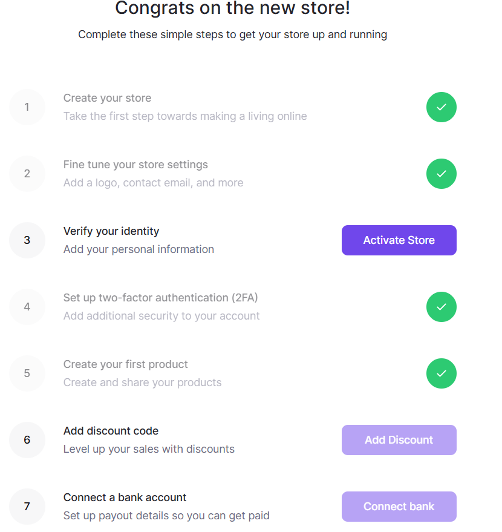

# lemonsqueezy 정리

Easy peasy lemon squeezy. 마치 레몬 짜듯이 쉽다라는 영어 속담이 있다.

레몬스퀴즈는 이러한 속담을 바탕으로 만들어진 서비스로, 결제 서비스를 구축하기까지

제일 간편한 형태를 추구하는 기업이다.

국내에서는 페이플이 가장 많은 결제 수단과 구독 방법을 제공하지만 아무래도 레몬 스퀴즈는

가입비, 연회비 없이 건 당 7% 정도의 수수료를 떼어가는 식으로 되어 있기 때문에

실제로 상품을 판매할 목적이 아닌 학습용으로는 실제 서비스 구축까지도 좋은 대행사가

되리라 생각했다. 그래서, 바로 진행해 보았다.

### 가입

굉장히 빠르고 강력한 가입 절차다.

바로 판매할 스토어 이름을 정하고, 로고나 이메일 같은 상점 꾸미기 좀 하고,

본인 인증만 하면 스토어가 활성화된다. 

여기서 스토어는 대행사를 거칠 때 우리 회사의 이름이 되는 거고, 오픈 마켓 형태일 경우에는

여러 개의 스토어가 부설되는 것이다.

이후 가벼운 2단계 인증(Authy를 사용했다.) 등록과 판매할 상품(구독제 상품이 되었든, 실물이 되었든)만 등록하면

맙소사! 테스트 환경이 구성되었다.

### 결제

Checkout(결제)에는 두 가지 옵션이 존재하는데, 하나는 [링크](https://myunsyeya.lemonsqueezy.com/buy/4ac35e59-3437-44c3-8de8-573d4dec8902)이며, 하나는 [오버레이](https://myunsyeya.lemonsqueezy.com/buy/4ac35e59-3437-44c3-8de8-573d4dec8902?embed=1)이다.
오버레이는 a href=… 식으로 된 xml 블록을 하나 주기 때문에 그대로 가져다 html, jsx에 붙이면 바로 결제 페이지를 구성할 수 있다.

(결제 링크에 들어가면 위와 같은 결제창이 뜬다.)

심지어 모든 결제는 이메일 발송까지 자동 처리되고, 결제 관리도 내 스토어와 연결된 레몬스퀴즈 페이지에서 직접 구매자가 취소하거나 인보이스를 뽑거나 할 수 있다.

미친 편의성! 이지만 상품을 등록하고 다시 심사하는 과정 중에서 반려되는 경우가 많다고 한다. 

### 결론

높은 수수료와 심사가 좀 엄격한 면이 있지만 결제에 대해서는 아예 신경쓰지 않아도 되는 매력적인 대행사 레몬 스퀴즈,

레몬 스퀴즈는 작년 딱 이 날(2024년 7월 26일) 제일 큰 미국의 결제 대행사 Stripe에 인수되었다고 한다.

비록 개발자의 입장에서는 커스텀할 구석이 없어 다른 결제 대행사를 알아보러 가지만,

페이팔이나 비자카드 결제가 필요할 경우 바로 사용할만큼 편리한 서비스였다.

테스트 간 조금 작업해두었던 코드를 TIL에 동봉한다.