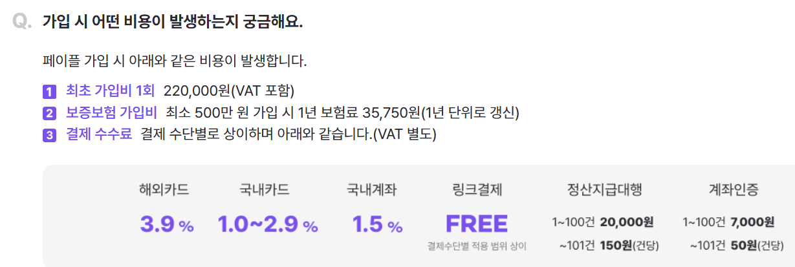

# Payple 정리
페이플은 국내의 2차 PG사 중 하나이다.

해외 결제의 수수료는 3.9%

가입비는 20만 원이다.

토스페이먼츠가 국내카드에 대해서 3.4%인 것에 반해

국내 카드의 수수료를 굉장히 적게 받는 매력이 있는 PG사이다.

페이플 자체가 스타트업이지만, 스타트업에 용이한 링크 결제(무통장 입금 느낌?)를

제공해주는 특징이 있다. 

해외카드가 환전 비용이 별도로 발생한다면 0.4% 정도 저렴한 수준이지만

마켓 플레이스 기능부터 해외 정기 결제까지 웬만한 결제 요소를 지원한다.

그러나, 해외 정기 결제까지 토스페이먼츠가 추가 계약을 통해 진행할 수 있음을

염두에 둔다면 가입비가 동일한 페이플을 쓸 이유가 약해지는 것도 사실이다.

다만 구현이 쉽기 때문에 경쟁력은 충분히 있을지도.